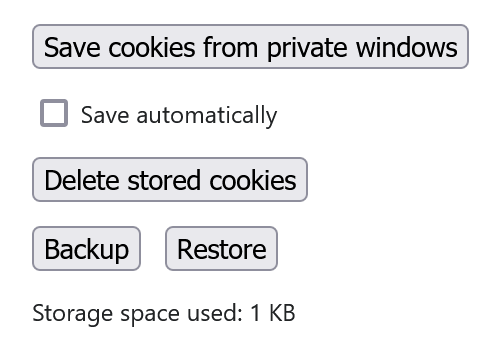

# Save private window cookies web browser extension

Save the cookies in private windows and restore them when a new private window is opened.

For saving website data (settings, to stay logged in to websites, etc.) in private windows.

How to use:
1. Install the extension and enable it in private windows
2. Open a new private window
3. Configure and/or log in to websites in the private window
4. Use the **Save cookies from private windows** button or **Save automatically** in the extension's Options
5. The private window can be closed now, the saved cookies will be restored automatically when a new private window is opened

This is a simple extension.\
Cookies are stored locally.\
No data is collected.

#### Permissions
- **Access data for all websites**: to save and restore cookies in private windows for all websites
- **Download files and read and modify the browser's download history**: to backup the saved cookies and remove the backup file from Downloads
- **Clear recent browsing history, cookies, and related data** (Mozilla Firefox only, done differently for Chromium because of API differences): only used to clear all cookies in open private windows when using the **Delete stored cookies** button and on Restore, before restoring the saved cookies

## Screenshot
\
Options (Mozilla Firefox)

## Install
- [Mozilla Firefox](https://addons.mozilla.org/en-US/firefox/addon/save-private-window-cookies/)
- [Google Chrome](https://chrome.google.com/webstore/detail/save-private-window-cooki/ojefealibpfjmbmljkdnhgobfllfempa)
- [Microsoft Edge](https://microsoftedge.microsoft.com/addons/detail/save-private-window-cooki/okhnojkilenjjeoeejhkodmdfhojicei)

## Credits
- Icon from [Bootstrap Icons](https://icons.getbootstrap.com/) v1.5.0 ([box-arrow-in-down](https://icons.getbootstrap.com/icons/box-arrow-in-down/))